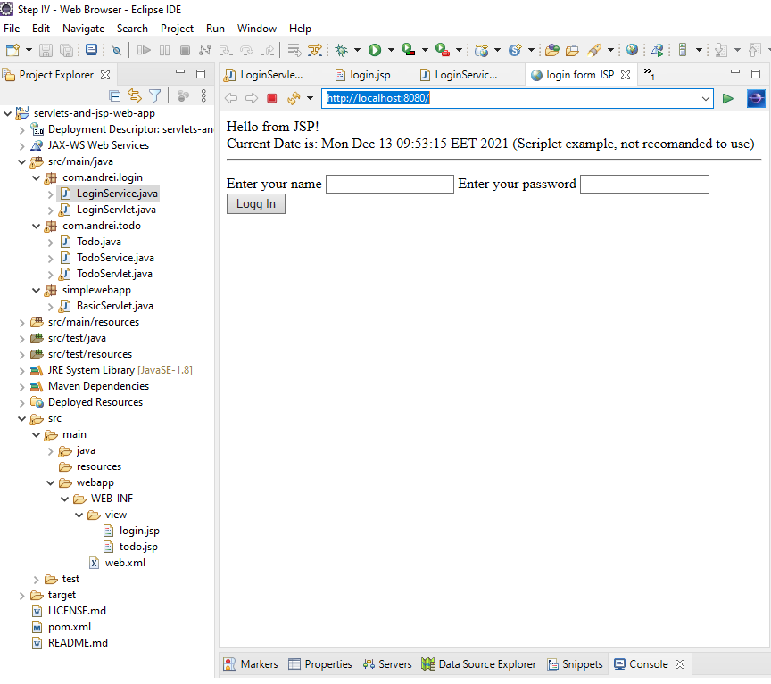

# servlets-and-jsp
Servlet and JSP Learning Project. First step.   
Create and manage a To do list:   
  - login,   
  - view Todo list,   
  - add Todo. 
 Two servlets(LoginServlet, TodoServlet) and two jsp files(login.jsp, todo.jsp) that work together and send data between them.
    
    
Maven project.   
  - Dependency: javax / javaee-web-api;  javax.servlet/jstl;  
  - Plugins: maven-war-plugin; maven-compiler-plugin; tomcat7-maven-plugin.

How to run in eclipse:  
  - import as maven project,  
  - right click on the project ->Run As ->Maven build  -> complete the field Goals : tomcat7:run,  
  - in browser localhost:8080    user: Andrei	pass: 111  
  
    
      
        

  
    
[BACK TO START PAGE](https://github.com/FlorescuAndrei/Start.git) 
